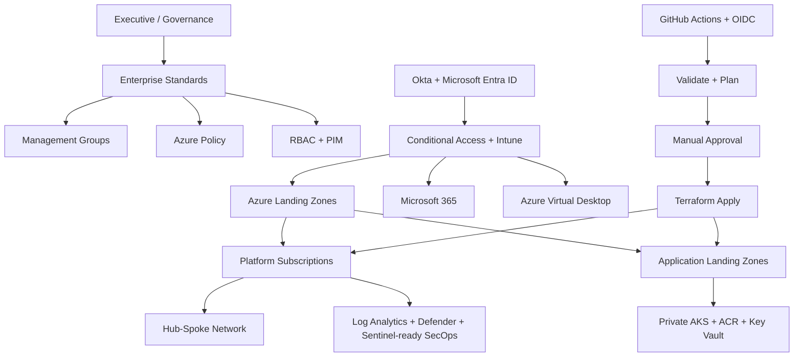

# Azure Enterprise Landing Zone Reference

[](https://github.com/mehtanjitesh-sys/azure-enterprise-landing-zone/actions/workflows/iac-validation.yml)
[](https://github.com/mehtanjitesh-sys/azure-enterprise-landing-zone/actions/workflows/terraform-plan.yml)
[](SECURITY.md)
[](docs/releases/v1.0.0.md)

This repository is an opinionated Fortune 500-style Azure enterprise landing zone blueprint.

It is built from the point of view of a principal cloud/platform architect who is responsible for the full company cloud foundation: governance, identity, network, security, operations, Microsoft 365/Intune, AVD, AKS, container workloads, CI/CD, and IaC.

## Portfolio Positioning

This repository is an actively maintained Azure enterprise landing zone reference created as part of my cloud architecture portfolio and professional development work. It is designed to demonstrate how I think through governance, security, identity, automation, operational readiness, and workload onboarding in an enterprise cloud program.

The code is plan-first and tenant-safe by design. Workflows that would deploy or publish to Azure require explicit manual execution, configured GitHub secrets, OIDC federation, and production environment approval.

## Architecture At A Glance



**Diagram scope:** This README diagram is a conceptual executive view. See `docs/diagrams/executive-architecture.md` for the decision-maker view and `docs/diagrams/technical-architecture.md` for the logical/deployable view.

## What This Is

This is not a tiny demo. It is an enterprise reference implementation that defines:

- Cloud operating model
- Management group and subscription hierarchy
- Governance standards
- Azure Policy baseline
- Azure RBAC model
- Okta to Microsoft Entra ID identity pattern
- Microsoft 365 and Intune security posture
- Hub-spoke network foundation
- Security operations and logging model
- Azure Virtual Desktop landing zone pattern
- Production AKS application landing zone
- Terraform-first IaC implementation
- Bicep examples for Azure-native teams
- GitHub Actions plan, manual approval, apply, container build, and AKS deploy flows
- Kubernetes workload security and autoscaling examples

## Quickstart: Clone To Plan

This quickstart is intentionally plan-first. Do not apply into a real tenant until management group names, subscription IDs, Entra group object IDs, IP ranges, licensing, and approvals are confirmed.

```bash
git clone https://github.com/mehtanjitesh-sys/azure-enterprise-landing-zone.git
cd azure-enterprise-landing-zone

# Bootstrap Terraform state once per environment.
pwsh ./scripts/bootstrap-state.ps1 \
  -ResourceGroupName rg-tfstate-prod \
  -StorageAccountName sttfstateprod001 \
  -Location eastus \
  -ContainerName tfstate

cd terraform/envs/prod
cp terraform.tfvars.example terraform.tfvars

terraform init \
  -backend-config="resource_group_name=rg-tfstate-prod" \
  -backend-config="storage_account_name=sttfstateprod001" \
  -backend-config="container_name=tfstate" \
  -backend-config="key=prod.tfstate"

terraform fmt -recursive ../..
terraform validate
terraform plan -out=tfplan
```

## Architecture Docs

Start here:

- `docs/executive-architecture-decision-pack.md`
- `docs/architecture.md`
- `docs/diagrams/executive-architecture.md`
- `docs/diagrams/technical-architecture.md`
- `docs/adr/`
- `docs/standards/governance-standards.md`
- `docs/standards/policy-catalog.md`
- `docs/standards/subscription-vending-standard.md`
- `docs/standards/security-control-matrix.md`
- `docs/standards/microsoft-defender-security-architecture.md`
- `docs/standards/aks-platform-standard.md`
- `docs/standards/platform-operating-model.md`
- `docs/implementation-runbook.md`
- `docs/github-setup.md`
- `docs/cost/cost-governance.md`
- `docs/validation/sanitized-terraform-plan.md`
- `docs/portfolio/readme-audit-checklist.md`
- `docs/portfolio/github-actions-pipeline-design.md`
- `docs/portfolio/github-repo-settings.md`

## IaC Structure

```text
terraform/
  envs/prod/
  modules/
    policy/
    rbac/
    management-observability/
    security-defender/
    network-hub/
    aks-workload/

bicep/
  main.bicep
  modules/
    governance/
    network/
    aks/

kubernetes/
  app001/
    namespace.yaml
    deployment.yaml
    hpa.yaml
```

## Enterprise Baseline

The Terraform implementation includes:

- Management groups
- Enterprise policy initiative
- Required tags
- Allowed locations
- Public IP guardrail
- Storage public access guardrail
- Storage secure transfer guardrail
- Key Vault soft delete and purge protection guardrails
- AKS private cluster and Azure Policy audits
- VM SKU control
- RBAC assignments
- Management observability workspace
- Platform action group
- Subscription budget alerts
- Microsoft Defender for Cloud workspace connection
- Microsoft Defender for Cloud production plans
- Defender for Endpoint and Cloud Apps settings
- Hub network starter
- Private AKS workload landing zone
- ACR Premium
- Key Vault Premium
- Log Analytics
- AKS node autoscaling
- Workload identity and OIDC issuer
- Key Vault secrets provider

## Production Deployment Flow

```text
Pull request
  -> Terraform validate and plan
  -> Review
  -> Merge to main
  -> Manual Terraform apply workflow dispatch
  -> GitHub production environment approval
  -> Terraform apply through OIDC federation
```

## Validation And Proof

This repo includes the proof signals reviewers expect in a serious infrastructure portfolio:

- GitHub Actions for Terraform validation, Bicep build, Checkov scanning, Terraform plan, manual Terraform apply, manual container publish, and manual AKS deploy
- Preflight checks that fail with direct missing-secret or missing-variable messages before Azure authentication
- ADRs explaining major architecture decisions
- Security architecture covering Microsoft Defender for Cloud, Microsoft Defender for Endpoint, Microsoft Defender for Cloud Apps, RBAC, Azure Policy, Key Vault, private AKS, and workload identity
- Sanitized Terraform plan evidence in `docs/validation/sanitized-terraform-plan.md`
- Cost governance and tagging model in `docs/cost/cost-governance.md`
- Dependabot configuration for GitHub Actions, Terraform, and Docker dependency visibility

## Important

This repo is a strong enterprise starter, but a real company rollout still requires tenant-specific decisions:

- Tenant ID
- Management group names
- Subscription IDs
- Approved regions
- IP address plan
- Entra group object IDs
- Okta integration pattern
- Microsoft 365 licensing
- Defender/Sentinel licensing
- AVD persona model
- Data classification requirements
- Regulatory compliance mapping

## Recommended First Steps

1. Read `docs/architecture.md`.
2. Review the governance standards.
3. Replace example object IDs in `terraform/envs/prod/terraform.tfvars.example`.
4. Bootstrap Terraform remote state.
5. Configure GitHub OIDC and environments.
6. Run Terraform plan.
7. Apply governance first.
8. Deploy platform services.
9. Deploy the first AKS landing zone.

## Sources

This design follows Microsoft guidance for Azure landing zones, Azure Policy, Azure RBAC, Intune security baselines, and AKS baseline architecture. Links are included in `docs/architecture.md`.
