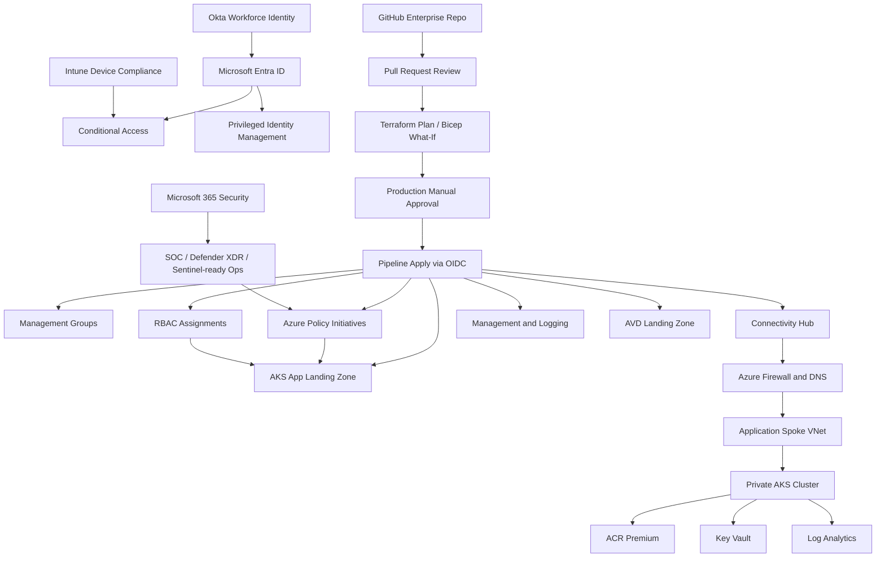

# Enterprise Azure Landing Zone Architecture

## 1. Executive Architecture Statement

This platform is designed as the controlled cloud foundation for a Fortune 500 enterprise. It assumes Azure is not a side project. Azure is treated as a production-grade operating environment for regulated workloads, global applications, remote workforce capabilities, security operations, and modern container platforms.

The architecture is intentionally opinionated:

- Governance is the first deployment, not an afterthought.
- Identity is the control plane.
- Policy defines the platform contract.
- Networking is private by default.
- Production change happens only through Git, review, plan, approval, and pipeline.
- Application teams get speed, but only inside guardrails.
- Security, cost, reliability, and operations are engineered into the landing zone.

The goal is to give the company a repeatable cloud factory: standardized subscriptions, automated landing zones, secure connectivity, monitored workloads, governed Kubernetes platforms, and clear operational ownership.

## 2. Architecture North Star

The enterprise cloud estate is organized into four planes:

| Plane | Purpose | Owned By |
|---|---|---|
| Governance plane | Management groups, policies, RBAC, naming, tagging, budgets, compliance | Cloud Governance Board |
| Platform plane | Connectivity, identity integration, management, logging, security services | Platform Engineering |
| Workload plane | Application landing zones, AKS, PaaS, data services, app networks | Product and App Teams |
| Endpoint and productivity plane | Microsoft 365, Intune, Conditional Access, AVD, endpoint security | EUC and Security Teams |

The core rule is simple: platform teams build paved roads; application teams move fast on those roads.

## 3. Microsoft-Aligned Design Areas

This design follows the Azure landing zone design areas:

- Billing and tenant setup
- Identity and access management
- Resource organization
- Network topology and connectivity
- Security
- Management and monitoring
- Governance
- Platform automation and DevOps

Reference guidance:

- Azure landing zones: https://learn.microsoft.com/en-us/azure/cloud-adoption-framework/ready/landing-zone/
- Azure landing zone design areas: https://learn.microsoft.com/en-us/azure/cloud-adoption-framework/ready/landing-zone/design-areas
- Azure Policy: https://learn.microsoft.com/en-us/azure/governance/policy/overview
- Azure RBAC best practices: https://learn.microsoft.com/en-us/azure/role-based-access-control/best-practices
- AKS baseline architecture: https://learn.microsoft.com/en-us/azure/architecture/reference-architectures/containers/aks/baseline-aks
- Intune security baselines: https://learn.microsoft.com/en-us/intune/device-security/security-baselines/overview

## 4. Enterprise Principles

### 4.1 Governance

1. Every subscription belongs to a management group.
2. Every management group has a defined purpose and policy baseline.
3. Every production workload has an accountable business owner, technical owner, cost center, and data classification.
4. Every exception has an expiration date.
5. Every privileged role is assigned to a group, preferably PIM eligible, not permanent.
6. Every deployment is traceable to a pull request, pipeline run, and approval.

### 4.2 Security

1. No public access unless explicitly approved.
2. No shared secrets in code, variables, pipeline logs, or container images.
3. Managed identity and workload identity are preferred over service principal secrets.
4. Defender for Cloud is enabled for production subscriptions.
5. Logs required for audit, detection, and incident response are centralized.
6. Key Vault uses RBAC, soft delete, purge protection, diagnostic settings, and private endpoint for production.

### 4.3 Network

1. Hub-spoke is the default enterprise topology.
2. Egress is controlled through Azure Firewall or an approved network virtual appliance.
3. Private endpoints are required for critical PaaS services.
4. DNS is centrally managed.
5. Spoke networks do not peer directly to each other except by approved pattern.
6. Network CIDR allocation is owned by the network platform team.

### 4.4 Application Platform

1. AKS is the default container platform for complex services.
2. App Service or Container Apps can be used for simpler services, but must follow the same identity, network, policy, and observability standards.
3. AKS clusters are private by default.
4. Production clusters run across availability zones where the region supports it.
5. Autoscaling is mandatory: cluster autoscaler for nodes and HPA/KEDA for workloads.
6. Containers run as non-root with resource requests, limits, probes, and restricted capabilities.

## 5. Management Group Hierarchy

```text
Tenant Root Group
`-- contoso
    |-- platform
    |   |-- identity
    |   |-- connectivity
    |   `-- management
    |-- landing-zones
    |   |-- corp
    |   |-- online
    |   |-- data
    |   |-- aks
    |   `-- avd
    |-- sandbox
    |-- migration
    `-- decommissioned
```

### 5.1 Management Group Intent

| Management Group | Intent | Default Enforcement |
|---|---|---|
| `platform` | Shared services owned by platform teams | Strict |
| `identity` | Identity integration, domain dependencies, privileged access support | Strict |
| `connectivity` | Hub network, DNS, firewall, VPN, ExpressRoute | Strict |
| `management` | Logging, monitoring, backup, security exports | Strict |
| `landing-zones` | Parent for application subscriptions | Standard |
| `corp` | Internal workloads without direct internet exposure | Standard |
| `online` | Internet-facing workloads | Strict network/security |
| `data` | Data platforms, analytics, regulated storage | Strict data controls |
| `aks` | Enterprise Kubernetes workload subscriptions | Strict container baseline |
| `avd` | Azure Virtual Desktop workloads | EUC baseline |
| `sandbox` | Time-bound experimentation | Budget-limited |
| `migration` | Temporary migration staging | Audit-first |
| `decommissioned` | Retained inactive subscriptions | Locked down |

## 6. Subscription Architecture

| Subscription | Management Group | Purpose |
|---|---|---|
| `sub-platform-identity-prod` | `identity` | Entra integration, Okta sync patterns, domain and identity support services |
| `sub-platform-connectivity-prod` | `connectivity` | Hub VNet, Azure Firewall, DNS, private resolver, ExpressRoute/VPN |
| `sub-platform-management-prod` | `management` | Log Analytics, Sentinel-ready workspace, Defender exports, automation |
| `sub-platform-security-prod` | `management` | Security tooling, automation, incident response assets |
| `sub-avd-prod` | `avd` | AVD host pools, workspace, app groups, session hosts |
| `sub-app001-prod` | `aks` | First production AKS application platform |
| `sub-app001-nonprod` | `aks` | Dev/test/stage for first application |
| `sub-data-prod` | `data` | Enterprise data services |
| `sub-sandbox-shared` | `sandbox` | Controlled labs and learning |

## 7. Governance Baseline

Governance is implemented with Azure Policy, Azure RBAC, management group structure, resource locks, budgets, Defender for Cloud, diagnostic settings, and Git-based change control.

### 7.1 Enterprise Tag Standard

Required tags:

| Tag | Example | Purpose |
|---|---|---|
| `Environment` | `prod`, `nonprod`, `sandbox` | Environment classification |
| `Owner` | `platform-network`, `app001-team` | Technical accountability |
| `BusinessUnit` | `finance`, `operations`, `digital` | Business alignment |
| `CostCenter` | `cc-100245` | Chargeback/showback |
| `DataClassification` | `public`, `internal`, `confidential`, `restricted` | Security and compliance handling |
| `Criticality` | `tier0`, `tier1`, `tier2`, `tier3` | Resilience and support priority |
| `ManagedBy` | `terraform`, `bicep`, `manual-exception` | Ownership source |

### 7.2 Policy Baseline

The initial policy initiative enforces or audits:

- Allowed regions
- Required enterprise tags
- Deny public IP creation except approved landing zones
- Deny public blob access
- Require secure transfer for storage
- Require Key Vault soft delete
- Require Key Vault purge protection
- Audit unrestricted network access
- Audit missing diagnostics
- Audit AKS clusters without Azure Policy
- Audit AKS clusters without private API server
- Deny unapproved VM SKU families

### 7.3 Enforcement Strategy

| Control Type | Initial Mode | Target Mode |
|---|---|---|
| Required tags | Deny | Deny |
| Allowed locations | Deny | Deny |
| Public blob access | Deny | Deny |
| Secure storage transfer | Deny | Deny |
| Key Vault soft delete | Deny | Deny |
| Key Vault purge protection | Audit | Deny after migration readiness |
| Diagnostics | Audit | DeployIfNotExists |
| Defender plans | Audit | DeployIfNotExists |
| Private endpoints | Audit | Deny for restricted data |

## 8. RBAC and Privileged Access

All access is group-based. Users are not assigned directly to Azure roles except emergency break-glass identities.

| Group | Scope | Role | Assignment Type |
|---|---|---|---|
| `az-platform-breakglass-admins` | Tenant root | Owner/User Access Administrator | Permanent, limited accounts |
| `az-platform-owners` | `platform` MG | Owner | PIM eligible |
| `az-policy-admins` | Tenant root | Resource Policy Contributor | PIM eligible |
| `az-network-admins` | Connectivity subscription | Network Contributor | PIM eligible |
| `az-security-admins` | Tenant root | Security Admin/Security Reader | PIM eligible |
| `az-soc-operators` | Management subscription | Microsoft Sentinel Contributor | PIM eligible |
| `az-app001-devops-prod` | App001 prod RG | Contributor | PIM eligible |
| `az-app001-readers-prod` | App001 prod RG | Reader | Permanent |
| `az-app001-aks-admins` | AKS cluster | AKS RBAC Cluster Admin | PIM eligible |
| `az-app001-aks-developers` | AKS namespaces | Kubernetes RBAC | Permanent or PIM by criticality |
| `az-avd-admins` | AVD subscription | Desktop Virtualization Contributor | PIM eligible |
| `az-avd-helpdesk` | AVD RG | Desktop Virtualization User Session Operator | Permanent |

## 9. Identity: Okta to Microsoft Entra ID

### 9.1 Target Position

Okta can remain the authoritative workforce identity system, while Microsoft Entra ID is the authorization and policy enforcement plane for Azure, Microsoft 365, Intune, and AVD.

### 9.2 Recommended Pattern

1. Provision users and groups from Okta to Entra ID using SCIM where Okta is authoritative.
2. Federate sign-in only after break-glass accounts, Conditional Access exclusions, and rollback plan are tested.
3. Use Entra Conditional Access for Microsoft cloud access decisions.
4. Use Intune compliance as a Conditional Access signal.
5. Use Entra PIM for Azure and Entra privileged roles.
6. Use separate admin accounts for privileged operations.
7. Keep two cloud-only break-glass accounts excluded from federation and Conditional Access.

## 10. Microsoft 365 and Intune

Microsoft 365 and Intune are treated as part of the landing zone because endpoint posture affects cloud access.

### 10.1 Microsoft 365 Security

- Defender XDR enabled.
- Defender for Office policies deployed in rings.
- Audit logging enabled.
- Purview sensitivity labels mapped to data classification.
- SharePoint and OneDrive external sharing restricted by default.
- Teams guest access governed by business-approved access packages.
- Privileged Microsoft 365 roles use PIM.

### 10.2 Intune Endpoint Baseline

- Windows Autopilot for corporate provisioning.
- Intune enrollment required for corporate endpoints.
- Compliance policies for Windows, macOS, iOS, Android.
- BitLocker required for Windows.
- Defender for Endpoint onboarded.
- Attack surface reduction rules deployed in audit, then block.
- Local admin rights removed by default.
- Update rings and quality update policies used for staged patching.
- Device compliance required for Azure portal, Microsoft 365, and AVD access.

## 11. Network Architecture

### 11.1 Topology

```text
Connectivity Subscription
`-- Hub VNet
    |-- AzureFirewallSubnet
    |-- AzureBastionSubnet
    |-- GatewaySubnet
    |-- Private DNS Resolver inbound subnet
    |-- Private DNS Resolver outbound subnet
    `-- Shared services subnet

Application Subscription
`-- App Spoke VNet
    |-- AKS system node subnet
    |-- AKS user node subnet
    |-- Private endpoint subnet
    |-- Ingress subnet
    `-- Data subnet
```

### 11.2 Network Rules

- Hub owns egress, ingress inspection, DNS, and hybrid connectivity.
- Spokes use UDRs to route internet-bound traffic through firewall.
- Private DNS zones are linked centrally.
- App teams do not create arbitrary peerings.
- Production PaaS services use private endpoints.
- Internet-facing workloads use approved ingress patterns: Azure Front Door + WAF, Application Gateway WAF, or approved ingress controller.

## 12. Security Operations

### 12.1 Logging

Required central logs:

- Azure Activity Logs
- Entra audit and sign-in logs
- Azure Policy compliance
- Defender for Cloud alerts
- AKS control plane logs
- AKS container logs
- Azure Firewall logs
- Key Vault audit events
- Storage audit events
- AVD connection and session logs
- GitHub Actions audit trail where available

### 12.2 Detection and Response

- Security alerts route to SOC.
- Production incidents have runbooks and severity mapping.
- High-risk policy changes require security approval.
- Break-glass usage triggers alert.
- Public exposure findings are severity 1 unless explicitly approved.

## 13. AKS Enterprise Platform

The first application landing zone is designed as a production AKS platform.

### 13.1 AKS Controls

- Private cluster enabled.
- Entra-integrated RBAC enabled.
- Azure RBAC for Kubernetes enabled.
- Azure CNI networking.
- Azure network policy.
- Azure Policy add-on enabled.
- OIDC issuer and workload identity enabled.
- System node pool isolated from user workloads.
- User node pool uses autoscaling.
- Availability zones enabled.
- ACR Premium with admin user disabled.
- Key Vault RBAC enabled with purge protection.
- Container Insights enabled.
- App workloads include requests, limits, probes, and restricted security context.

### 13.2 Scale Design

| Layer | Scale Mechanism |
|---|---|
| Pods | Horizontal Pod Autoscaler and KEDA |
| Nodes | AKS cluster autoscaler |
| Ingress | Application Gateway or NGINX ingress behind WAF |
| Container registry | ACR Premium geo-replication if multi-region |
| Secrets | Key Vault CSI driver and workload identity |
| Deployment | Blue/green or canary release through GitOps |

### 13.3 Production Readiness

Before production:

- Define namespace model.
- Define ingress model.
- Define certificate and DNS ownership.
- Define backup and restore for stateful workloads.
- Define patching and node image upgrade process.
- Define cluster upgrade policy.
- Define runtime security scanning.
- Define incident response runbooks.

## 14. Azure Virtual Desktop

AVD gets its own landing zone because it has specialized endpoint, identity, storage, and support requirements.

Standards:

- Host pools by persona and region.
- FSLogix profile storage on Azure Files Premium or Azure NetApp Files.
- Session hosts managed through Intune where supported.
- Golden images built through an image pipeline.
- Access assigned through Entra groups.
- Conditional Access requires MFA and compliant device unless approved exception.
- AVD diagnostics exported centrally.
- Helpdesk gets session operator roles only.

## 15. IaC and CI/CD Architecture

### 15.1 Repository Contract

Every change must be:

1. Proposed in Git.
2. Reviewed in pull request.
3. Validated by pipeline.
4. Planned before apply.
5. Approved for production.
6. Applied by workload identity.
7. Logged and auditable.

### 15.2 Terraform Ownership

Terraform owns:

- Management groups
- Policy definitions, initiatives, and assignments
- RBAC assignments
- Hub network starter
- AKS app landing zone starter
- ACR, Key Vault, Log Analytics

### 15.3 Bicep Ownership

Bicep examples are provided for Azure-native teams. Do not manage the same resources with Terraform and Bicep in production unless ownership boundaries are explicit.

## 16. Exception and Waiver Process

Exceptions require:

- Policy name
- Scope
- Business justification
- Expiration date
- Risk owner
- Compensating control
- Approval from security and cloud governance

Permanent exceptions are not allowed. If an exception is long-lived, the standard must be reviewed.

## 17. Architecture Diagram



## 18. Implementation Waves

| Wave | Outcome |
|---|---|
| 0 | Tenant readiness, break-glass, identity groups, GitHub repo, state backend |
| 1 | Management groups, governance policy, RBAC baseline |
| 2 | Connectivity hub, DNS, firewall, logging workspace |
| 3 | Security operations, Defender, diagnostic exports |
| 4 | AKS landing zone, ACR, Key Vault, workload identity |
| 5 | Microsoft 365 and Intune enforcement rings |
| 6 | AVD pilot and production rollout |
| 7 | Subscription vending and landing-zone factory |

## 19. What Makes This Enterprise

This is enterprise architecture because it defines the operating model, not just resources. The platform has standards, guardrails, enforcement, escalation paths, exception handling, identity boundaries, network control, logging, CI/CD discipline, autoscaling, and security ownership.

The IaC in this repository is the start of the platform implementation. The architecture documents define the contract the company operates under.
