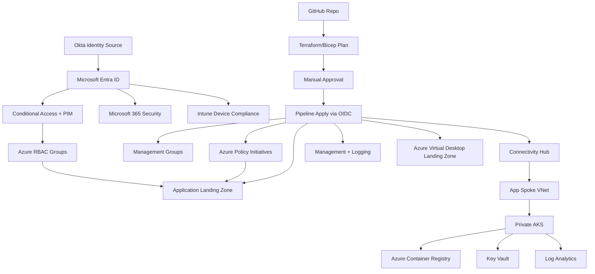

# Enterprise Azure Landing Zone Architecture

## 1. Executive Summary

This document defines a greenfield Azure enterprise platform for a Fortune 500 organization. The architecture starts with governance because governance decides the operating model before teams deploy workloads. The platform uses Microsoft Cloud Adoption Framework Azure landing zone principles, Microsoft Entra ID, Microsoft 365 security, Intune, Azure Policy, Azure RBAC, hub-spoke networking, centralized logging, Azure Virtual Desktop, and Kubernetes-based workload hosting.

The target state is a secure, scalable, automated cloud foundation where application teams can deploy containerized workloads through governed landing zones without bypassing enterprise controls.

## 2. Reference Guidance

This design is aligned to these Microsoft references:

- Azure landing zones provide a standardized way to set up and manage Azure at scale with security, compliance, and operational consistency: https://learn.microsoft.com/en-us/azure/cloud-adoption-framework/ready/landing-zone/
- Azure landing zone design areas include billing and tenant, identity and access, resource organization, networking, security, management, governance, and platform automation: https://learn.microsoft.com/en-us/azure/cloud-adoption-framework/ready/landing-zone/design-areas
- Azure Policy enforces organizational standards and assesses compliance at scale: https://learn.microsoft.com/en-us/azure/governance/policy/overview
- Azure RBAC should follow least privilege and avoid broad privileged assignments: https://learn.microsoft.com/en-us/azure/role-based-access-control/best-practices
- AKS baseline architecture should use private networking, managed identity, Key Vault, Azure Policy, monitoring, and secure ingress patterns: https://learn.microsoft.com/en-us/azure/architecture/reference-architectures/containers/aks/baseline-aks
- Intune security baselines provide Microsoft-recommended configuration groups for Windows and endpoint security: https://learn.microsoft.com/en-us/intune/device-security/security-baselines/overview

## 3. Architecture Principles

1. Governance first: management groups, policy, RBAC, and compliance controls exist before workloads.
2. Identity is the control plane: Okta, Microsoft Entra ID, Conditional Access, Privileged Identity Management, and group-based access define who can do what.
3. Everything is code: Azure resources, policies, RBAC, network, AKS, and workload platforms are managed through Terraform or Bicep.
4. No direct production changes: production changes run through GitHub pull requests, plan review, manual approval, and pipeline apply.
5. Least privilege by default: avoid subscription Owner, use custom roles where justified, and scope access to management group, subscription, resource group, or workload level.
6. Private by default: management, workload, container registry, Key Vault, storage, AKS API, and databases use private connectivity where practical.
7. Central observability: activity logs, diagnostic settings, security alerts, AKS logs, endpoint signals, and Microsoft 365 security data feed central operations.
8. Landing zone autonomy with guardrails: workload teams own application deployment, while platform teams own shared policy, network, identity, and security controls.

## 4. Target Management Group Model

```text
Tenant Root Group
└── contoso
    ├── platform
    │   ├── identity
    │   ├── connectivity
    │   └── management
    ├── landing-zones
    │   ├── corp
    │   ├── online
    │   └── avd
    ├── sandbox
    └── decommissioned
```

### Purpose

- `platform`: shared enterprise services.
- `identity`: domain services, identity integration, privileged access components.
- `connectivity`: hub networking, firewall, VPN, ExpressRoute, DNS, private resolver.
- `management`: Log Analytics, Sentinel-ready workspaces, automation, update management, backup, recovery.
- `landing-zones`: application landing zones.
- `corp`: private/internal workloads.
- `online`: internet-facing workloads.
- `avd`: Azure Virtual Desktop host pools and session host environments.
- `sandbox`: controlled experimentation with budget and policy limits.
- `decommissioned`: retained subscriptions during migration exit or audit hold.

## 5. Subscription Model

| Subscription | Owner | Purpose |
|---|---|---|
| `sub-platform-identity-prod` | Identity Platform | Entra integration, domain services, privileged identity support |
| `sub-platform-connectivity-prod` | Network Platform | Hub VNet, Azure Firewall, Private DNS, ExpressRoute/VPN |
| `sub-platform-management-prod` | Cloud Operations | Log Analytics, Sentinel-ready workspace, Defender exports, backup |
| `sub-avd-prod` | EUC Platform | AVD host pools, workspace, app groups, golden image integration |
| `sub-app001-prod` | Application Team + Platform | First application AKS landing zone |
| `sub-sandbox-shared` | Platform | Time-bound experimentation |

## 6. Governance Baseline

### Policy Strategy

Policies are assigned at management group scope where possible. Start in `Audit` mode during discovery, then move to `Deny`, `Modify`, or `DeployIfNotExists` after exception processes exist.

Baseline policy initiatives:

- Allowed Azure regions
- Required tags: `CostCenter`, `Environment`, `Owner`, `DataClassification`, `BusinessUnit`
- Deny public IP creation except approved scopes
- Require diagnostic settings to central Log Analytics
- Require secure transfer for storage
- Deny storage account public blob access
- Require Key Vault purge protection and soft delete
- Require Defender plans for cloud workloads
- Require AKS Azure Policy add-on
- Require private endpoints for approved PaaS services
- Audit VMs without approved endpoint protection
- Audit resources missing backup where applicable

### Exception Model

Every policy exemption must include:

- Business justification
- Expiration date
- Risk owner
- Compensating control
- Approval from cloud governance board

## 7. RBAC Model

Use Entra security groups for role assignment. Do not assign roles directly to users except break-glass accounts.

| Group | Scope | Role |
|---|---|---|
| `az-platform-owners` | `platform` MG | Owner, PIM eligible only |
| `az-policy-admins` | Tenant root or platform MG | Resource Policy Contributor |
| `az-network-admins` | Connectivity subscription | Network Contributor |
| `az-security-readers` | Tenant root | Security Reader |
| `az-soc-operators` | Management subscription | Microsoft Sentinel Contributor |
| `az-app001-devops` | App subscription RG | Contributor |
| `az-app001-aks-admins` | AKS cluster | Azure Kubernetes Service RBAC Cluster Admin |
| `az-app001-aks-developers` | AKS namespace | Kubernetes RBAC via Entra-integrated AKS |
| `az-avd-admins` | AVD subscription | Desktop Virtualization Contributor |
| `az-avd-helpdesk` | AVD resource groups | Desktop Virtualization User Session Operator |

RBAC controls what identity can do. Azure Policy controls what resource state is allowed. Use both.

## 8. Identity Architecture: Okta to Entra ID

### Target Pattern

Okta remains the workforce identity provider where required, while Microsoft Entra ID becomes the Microsoft cloud authorization and resource access control plane.

Recommended integration:

1. Use SCIM provisioning from Okta to Entra ID for user and group lifecycle where Okta is the identity master.
2. Use SAML or OIDC federation for Microsoft 365 sign-in only after design validation.
3. Use Entra Conditional Access for Microsoft cloud access decisions where licensing allows.
4. Use Entra Privileged Identity Management for privileged Azure and Entra roles.
5. Maintain two cloud-only break-glass accounts in Entra ID excluded from federation and protected with strong controls.

### Identity Controls

- MFA required for all users.
- Phishing-resistant MFA for privileged roles.
- Conditional Access by device compliance, risk, location, and application.
- Separate admin accounts from daily productivity accounts.
- Privileged access is eligible, time-bound, approved, and logged.
- Service principals use federated credentials from GitHub Actions where possible.
- Managed identities are preferred over client secrets for Azure services.

## 9. Microsoft 365 and Intune Architecture

### Microsoft 365 Security Baseline

- Microsoft Defender XDR enabled and integrated with SOC processes.
- Exchange Online Protection and Defender for Office policies hardened.
- Safe Links and Safe Attachments enabled for pilot, then broad deployment.
- Purview sensitivity labels aligned to data classification.
- Audit logging enabled.
- Teams external access and guest access governed by policy.
- SharePoint sharing defaults restricted and exception-based.

### Intune Baseline

- Devices enrolled into Intune.
- Compliance policies for Windows, macOS, iOS, and Android.
- Security baselines for Windows and Microsoft Defender.
- BitLocker required for Windows.
- Firewall enabled.
- Local admin restricted.
- Endpoint privilege management considered for controlled elevation.
- Windows Autopilot for corporate Windows provisioning.
- Update rings for staged patching.
- Application control and attack surface reduction rules rolled out progressively.

### Conditional Access Dependency

Azure, Microsoft 365, AVD, and administrative portals require compliant device or approved exception.

## 10. Network Architecture

### Topology

Use hub-spoke for predictable enterprise control.

```text
Connectivity Subscription
└── Hub VNet
    ├── Azure Firewall subnet
    ├── Bastion subnet
    ├── VPN or ExpressRoute gateway subnet
    ├── Private DNS Resolver subnet
    └── Shared services subnet

Application Subscription
└── App001 Spoke VNet
    ├── AKS system subnet
    ├── AKS user node subnet
    ├── Private endpoint subnet
    └── App gateway or ingress subnet
```

### Controls

- Spokes peer to hub.
- Egress routes to Azure Firewall.
- No direct internet egress from private workloads.
- Private DNS zones centrally managed.
- Private endpoints for Key Vault, ACR, Storage, databases.
- Network Security Groups and Application Security Groups applied by subnet role.
- DDoS Network Protection considered for internet-facing production workloads.

## 11. Security Architecture

### Azure Security

- Microsoft Defender for Cloud enabled.
- Defender plans configured according to workload criticality.
- Security recommendations triaged by SOC and platform owners.
- Activity logs exported centrally.
- Diagnostic settings enforced by policy.
- Key Vault uses RBAC authorization, purge protection, private endpoint, and soft delete.
- Secrets are not stored in pipelines or code.
- Container images are scanned before promotion.
- AKS uses private cluster, Entra integration, Azure RBAC, workload identity, network policies, and admission controls.

### Logging and Monitoring

Central management subscription hosts:

- Log Analytics workspace
- Sentinel-ready workspace
- Automation account where applicable
- Dashboards and alerts
- Diagnostic setting targets

Workload teams can have workload-specific workspaces, but security-critical logs also go to central operations.

## 12. Azure Virtual Desktop

AVD is placed in a dedicated `avd` landing zone because EUC has specialized identity, profile, image, and support requirements.

Design decisions:

- Host pools separated by persona, region, and environment.
- FSLogix profiles on Azure Files or Azure NetApp Files.
- Session hosts joined to Entra ID or hybrid joined based on application dependency.
- Intune manages session host configuration where supported.
- Golden images built through Azure Image Builder or existing enterprise image process.
- AVD traffic inspected according to enterprise network rules.
- User access assigned through Entra groups.
- Helpdesk receives scoped AVD operational roles only.

## 13. First Application Landing Zone

The first application platform uses AKS and containers.

### Resources

- Resource group
- Spoke VNet
- Private AKS cluster
- Azure Container Registry
- Key Vault
- User-assigned managed identity
- Log Analytics workspace integration
- Azure Monitor managed Prometheus and container insights where licensed/approved
- Private endpoints
- Azure Policy add-on for AKS
- Workload identity

### Container Platform

- Docker builds happen in GitHub Actions or enterprise build system.
- Images are pushed to ACR.
- AKS pulls from ACR through managed identity.
- Kubernetes manifests or Helm charts are deployed through GitOps or controlled pipeline.
- Admission policies enforce trusted registries, namespace labels, resource limits, non-root containers, and allowed ingress.

## 14. CI/CD Architecture

### Pull Request Workflow

1. Developer changes Terraform or Bicep.
2. Pull request triggers validation.
3. Pipeline runs format, init, validate, and plan.
4. Plan is uploaded as artifact.
5. Security review checks policy and RBAC changes.

### Apply Workflow

1. Merge to `main`.
2. Apply workflow targets GitHub `production` environment.
3. Manual approval required by environment reviewers.
4. Pipeline authenticates to Azure using OIDC.
5. Terraform apply runs using remote state.
6. Outputs are published.

## 15. Terraform and Bicep Strategy

Terraform is the primary enterprise orchestration tool because it can coordinate Azure, GitHub, Okta-adjacent resources, and future multi-cloud needs.

Bicep is included for Azure-native teams and platform modules where direct ARM alignment is preferred.

Recommended pattern:

- Terraform for platform orchestration, state, policy, RBAC, networking, AKS.
- Bicep for Azure-native module alternatives or teams standardized on Microsoft deployment stacks.
- Do not mix Terraform and Bicep against the same resource lifecycle unless ownership is explicit.

## 16. Operational Model

### Teams

- Cloud Governance Board: policy, exceptions, controls.
- Platform Engineering: landing zone code, shared services, pipelines.
- Identity Team: Okta, Entra, Conditional Access, PIM.
- Network Team: hub, firewall, routing, DNS.
- Security Operations: Defender, Sentinel, incident response.
- EUC Team: Intune, AVD, endpoint baselines.
- Application Teams: workload code and app-specific infrastructure.

### Change Control

- Normal changes through pull request and pipeline.
- Emergency changes require incident ticket, limited direct access, and post-change reconciliation back into IaC.
- Drift is detected by scheduled plan jobs.

## 17. Mermaid Architecture



## 18. Key Risks

- Federation mistakes can lock users out. Keep break-glass accounts cloud-only.
- Policy `deny` too early can block migrations. Start with audit, then enforce.
- Shared state ownership mistakes can damage production. Use remote state locking and environment separation.
- AKS without operational maturity is risky. Define patching, ingress, secrets, backup, and incident runbooks before production.
- Intune baselines can impact user productivity. Deploy in rings.

## 19. Next Decisions Needed

- Tenant ID and root management group name
- Azure regions and data residency model
- Subscription vending process
- Okta integration pattern: federation, provisioning, or both
- M365 licensing level
- AVD identity join model
- Firewall and DNS architecture
- AKS ingress standard
- GitHub organization and repository names
- Production approval group
