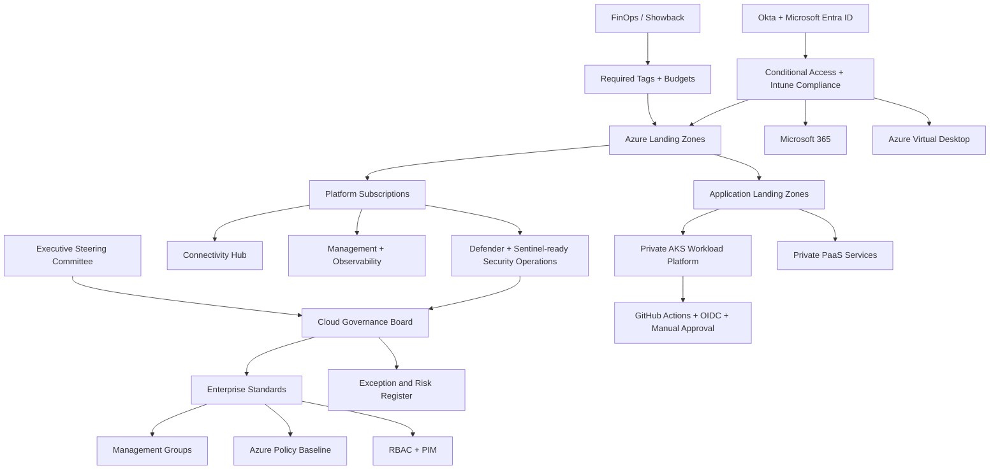

# Executive Architecture Diagram

This diagram shows the enterprise cloud operating model at decision-maker level.

## Executive Message

The architecture gives the business speed with control: identity determines access, governance defines the rules, platform engineering automates the landing zones, and security operations receives the telemetry needed to protect the estate.
