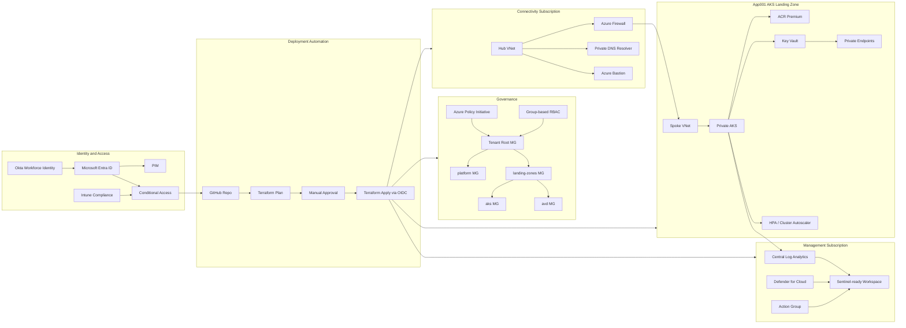

# Technical Architecture Diagram

This diagram shows the technical target state for the Azure landing zone reference.

## Technical Message

The platform uses Terraform as the orchestration layer, Bicep as an Azure-native reference path, GitHub Actions for validation and deployment, Azure Policy for guardrails, Entra ID for authorization, and Microsoft Defender/Sentinel-ready telemetry for security operations.
