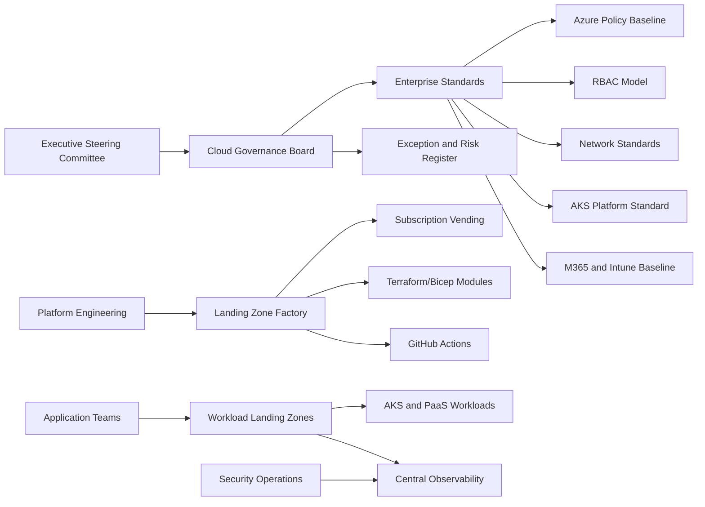

# Executive Architecture Decision Pack

## 1. Decision Required

Approve the enterprise Azure landing zone architecture as the mandatory foundation for all new Azure workloads, migrations, virtual desktop services, and platform engineering initiatives.

This decision establishes Azure as a governed enterprise platform, not a collection of independently managed cloud projects.

## 2. Executive Position

The company needs a cloud foundation that can support regulated workloads, global scale, mergers and acquisitions, remote workforce services, security operations, and modern application platforms without recreating controls for every project.

The proposed architecture creates that foundation by standardizing:

- Governance
- Identity
- Network topology
- Security controls
- Observability
- Cost accountability
- Landing-zone provisioning
- Kubernetes and container hosting
- Microsoft 365 and endpoint compliance integration
- CI/CD deployment discipline

The strategic decision is not whether to use Terraform, Bicep, AKS, Intune, or Azure Policy in isolation. The strategic decision is to operate cloud as a controlled product with standards, automation, and measurable accountability.

## 3. Business Outcomes

| Outcome | Executive Value |
|---|---|
| Faster workload onboarding | Application teams receive approved landing zones without waiting for manual design from scratch. |
| Lower operational risk | Policy, RBAC, private networking, and logging are enforced before workloads go live. |
| Audit readiness | Changes are traceable to Git commits, pull requests, approvals, and deployment logs. |
| Cost control | Mandatory tags, budgets, and ownership enable chargeback/showback and spend accountability. |
| Security consistency | Identity, endpoint posture, network access, and cloud resource controls are standardized. |
| Migration acceleration | Migration teams receive repeatable target environments. |
| Platform scalability | AKS, ACR, Key Vault, and CI/CD patterns support elastic modern applications. |
| Workforce modernization | AVD and Intune are integrated into the same identity and governance model. |

## 4. Architecture Thesis

The landing zone must be built in this order:

```text
Governance -> Identity -> Network -> Security Operations -> Platform Automation -> Workload Landing Zones
```

If governance is delayed, every workload becomes an exception.
If identity is weak, every control plane is weak.
If networking is not centralized, every project becomes a firewall design.
If logging is not mandatory, incidents become archaeology.
If IaC is optional, drift becomes the operating model.

## 5. Non-Negotiable Enterprise Guardrails

These are the defaults for production. Exceptions require documented business justification, risk ownership, expiration, and security approval.

| Area | Non-Negotiable Standard |
|---|---|
| Regions | Only approved Azure regions. |
| Identity | Group-based RBAC only; privileged roles through PIM. |
| Break-glass | Two cloud-only emergency accounts, monitored and excluded from federation. |
| Network | Private by default; public exposure only through approved ingress. |
| Egress | Controlled through Azure Firewall or approved equivalent. |
| Data | Restricted data requires private endpoints and encryption. |
| Secrets | Key Vault or approved secret store only. |
| Storage | Public blob access denied. |
| Key Vault | Soft delete and purge protection required for production. |
| AKS | Private cluster, Entra RBAC, Azure Policy, workload identity, autoscaling. |
| Endpoints | Intune compliance is a Conditional Access signal. |
| Deployment | Production changes through Git, plan, approval, pipeline apply. |
| Logging | Central diagnostic export for production resources. |
| Cost | Required tags and budgets. |

## 6. Target-State Operating Model



## 7. Architecture Decisions

| Decision | Standard | Rationale |
|---|---|---|
| Cloud operating model | Platform product model | Reduces project-by-project reinvention. |
| IaC primary tool | Terraform | Strong ecosystem, enterprise adoption, multi-service orchestration. |
| Azure-native alternative | Bicep | Useful for Azure-native teams and ARM-aligned modules. |
| Management model | CAF-aligned management groups | Clear inheritance for policy and RBAC. |
| Identity model | Okta source with Entra control plane | Preserves existing workforce identity while securing Azure/M365. |
| Privileged access | Entra PIM | Time-bound administrative access. |
| Network model | Hub-spoke | Centralized inspection, DNS, hybrid connectivity. |
| Public ingress | Front Door/App Gateway WAF approved patterns | Consistent protection for internet-facing apps. |
| Container platform | Private AKS | Enterprise-grade orchestration and autoscaling. |
| Secrets | Key Vault with workload identity | Removes static secrets from workloads and pipelines. |
| Endpoint control | Intune compliance into Conditional Access | Device posture becomes part of access control. |
| Production deployment | GitHub Actions with OIDC and manual approval | Traceable, secretless deployment model. |

## 8. Risk Register

| Risk | Impact | Control |
|---|---|---|
| Federation misconfiguration locks users out | Critical | Break-glass accounts, staged federation, rollback plan. |
| Policy deny blocks migration workloads | High | Audit-first for migration MG, phased enforcement. |
| Direct Owner assignments bypass governance | High | PIM, group-only RBAC, access reviews. |
| Public exposure of sensitive services | Critical | Deny public IP in corp/data, WAF-approved ingress, Defender alerts. |
| AKS operational immaturity | High | AKS platform standard, runbooks, upgrade policy, autoscaling. |
| Cost sprawl | Medium | Tags, budgets, FinOps reporting, SKU controls. |
| Tool fragmentation | Medium | Terraform primary, Bicep controlled exception. |
| Manual cloud drift | High | Pipeline-only changes, scheduled drift detection. |

## 9. Investment Roadmap

| Wave | Investment | Executive Outcome |
|---|---|---|
| 0 | Tenant readiness and identity safeguards | Safe foundation for change. |
| 1 | Management groups, policy, RBAC | Governance inheritance and access control. |
| 2 | Hub network, DNS, firewall | Secure connectivity and traffic control. |
| 3 | Logging, Defender, Sentinel-ready operations | Central visibility and incident readiness. |
| 4 | Landing-zone factory | Faster standardized workload onboarding. |
| 5 | AKS platform | Elastic application runtime. |
| 6 | M365, Intune, AVD integration | Secure workforce and virtual desktop platform. |
| 7 | FinOps and compliance dashboards | Continuous executive visibility. |

## 10. Success Metrics

| Metric | Target |
|---|---|
| Production resources with required tags | 98%+ |
| Subscriptions assigned to correct management group | 100% |
| Direct privileged user assignments | 0 except break-glass |
| Production public storage accounts | 0 |
| Production Key Vaults with purge protection | 100% |
| Production AKS private clusters | 100% |
| Production workloads deployed through pipeline | 95%+ |
| Critical logs routed centrally | 95%+ |
| Policy exceptions with expiration | 100% |
| Landing-zone provisioning time | Less than 1 business day after approval |

## 11. Recommended Executive Approval

Approve this architecture as the enterprise Azure standard and authorize platform engineering to implement it through IaC.

Approve the following mandates:

1. All new Azure subscriptions must be placed under the enterprise management group hierarchy.
2. All production cloud infrastructure must be deployed through approved IaC pipelines.
3. Azure Policy and RBAC baselines are mandatory.
4. All production workloads must meet logging, tagging, identity, network, and security standards.
5. Exceptions must be time-bound, risk-owned, and reviewed by cloud governance.

## 12. Message to Decision Makers

This architecture gives the company speed without losing control. It lets application teams deploy faster because the hard decisions are already encoded into the platform. It gives security and compliance teams visibility because guardrails are inherited. It gives finance ownership because costs are tagged and attributable. It gives executives confidence because cloud adoption becomes an operating model, not a collection of one-off projects.
