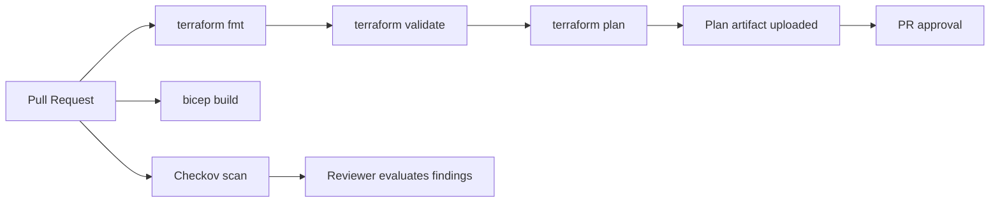
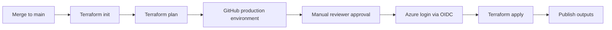

# GitHub Actions Pipeline Design

## 1. Purpose

The pipeline design proves that this repository is more than architecture prose. It shows how an enterprise Azure landing zone should be validated, reviewed, approved, and deployed through controlled automation.

The design intentionally separates validation, planning, approval, deployment, container build, and Kubernetes release operations.

## 2. Pipeline Principles

1. Pull requests validate and plan.
2. Merges to `main` can deploy only through protected environments.
3. Production apply requires manual approval.
4. Azure authentication uses OIDC, not long-lived secrets.
5. IaC security scanning runs before deployment.
6. Plan output is treated as approval evidence.
7. The pipeline must be safe to run without exposing tenant secrets.

## 3. Workflow Overview

| Workflow | Trigger | Purpose | Deployment? |
|---|---|---|---|
| `iac-validation.yml` | Pull request / manual | Terraform fmt, Terraform validate, Bicep build, Checkov scan | No |
| `terraform-plan.yml` | Pull request | Azure login, Terraform init, validate, plan, upload plan artifact | No |
| `terraform-apply.yml` | Push to `main` | Re-plan and apply after production environment approval | Yes |
| `container-build.yml` | Push to `main` under `src/**` | Build and push container image to ACR | Yes, image only |
| `kubernetes-deploy.yml` | Manual dispatch | Deploy Kubernetes manifests to AKS | Yes |

## 4. Pull Request Validation Flow



## 5. Production Apply Flow



## 6. Required GitHub Configuration

### Environments

Create a GitHub environment:

```text
production
```

Required environment settings:

- Manual reviewers enabled.
- Deployment branches limited to `main`.
- Environment variables for Terraform backend.
- No direct production apply from pull request branches.

### Secrets

Use GitHub OIDC where possible.

Required secrets:

```text
AZURE_CLIENT_ID
AZURE_TENANT_ID
AZURE_SUBSCRIPTION_ID
```

### Variables

Required variables:

```text
TF_STATE_RG
TF_STATE_STORAGE_ACCOUNT
TF_STATE_CONTAINER
ACR_NAME
ACR_LOGIN_SERVER
AKS_RESOURCE_GROUP
AKS_CLUSTER_NAME
```

## 7. Azure Identity Design

The pipeline identity should be a Microsoft Entra workload identity federated to GitHub Actions.

Recommended controls:

- Scope role assignments to the lowest practical scope.
- Use separate identities for plan/apply if the organization requires separation.
- Do not use client secrets.
- Monitor sign-ins for the workload identity.
- Review role assignments quarterly.

## 8. Validation Gates

| Gate | Required Result |
|---|---|
| Terraform format | Pass |
| Terraform validate | Pass |
| Terraform plan | No destructive change without explicit review |
| Bicep build | Pass |
| Checkov scan | No critical findings without documented exception |
| Manual approval | Required before production apply |
| Secret scanning | No committed secrets |
| Branch protection | Pull request required |

## 9. Evidence Artifacts

Each production change should preserve:

- Pull request link
- Commit SHA
- Terraform plan artifact
- Checkov scan summary
- Manual approval record
- Terraform apply run
- Outputs
- Exception references, if any

## 10. Recommended Future Enhancements

- Add TFLint.
- Add terraform-docs generation.
- Add Infracost pull request comments.
- Add Open Policy Agent or Conftest checks.
- Add Dependabot for GitHub Actions.
- Add release workflow for tagged versions.
- Add SARIF upload for all IaC scanners.
- Add scheduled drift detection.
- Add signed commits or branch protection requiring verified commits.

## 11. Portfolio Message

This pipeline design shows that the landing zone is treated like an enterprise platform product: validated, scanned, reviewed, approved, deployed, and audited through automation.
