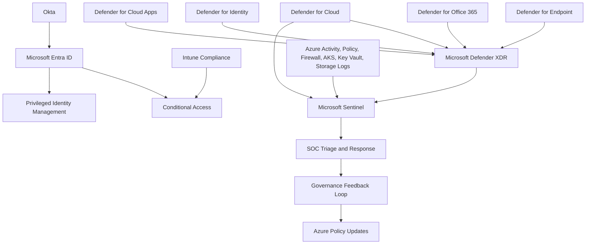

# Microsoft Defender and Security Operations Architecture

## 1. Security Position

The Azure landing zone is not approved for production until Microsoft Defender and security operations are part of the baseline.

Security is implemented as a layered operating model:

```text
Identity protection -> Endpoint protection -> Cloud posture -> Workload protection
-> Data protection -> Detection -> Incident response -> Governance feedback
```

The enterprise security stack uses:

- Microsoft Defender for Cloud for cloud security posture management and workload protection.
- Microsoft Defender XDR for unified incidents across identity, endpoint, email, SaaS, and cloud apps.
- Microsoft Sentinel as the SIEM/SOAR layer for correlation, hunting, automation, and long-term security operations.
- Microsoft Defender for Endpoint for device and server protection.
- Microsoft Defender for Office 365 for email and collaboration protection.
- Microsoft Defender for Identity for identity threat detection where hybrid identity exists.
- Microsoft Defender for Cloud Apps for SaaS visibility and session controls.
- Microsoft Intune for endpoint compliance and configuration enforcement.
- Microsoft Entra ID Protection and Conditional Access for identity risk controls.

## 2. Executive Security Outcome

The goal is to prevent preventable incidents, detect active threats quickly, and give the SOC the telemetry needed to investigate and respond.

| Outcome | Control |
|---|---|
| Prevent public exposure | Azure Policy, Defender for Cloud recommendations, WAF-approved ingress |
| Prevent unmanaged privileged access | PIM, group-based RBAC, access reviews |
| Prevent weak endpoint access | Intune compliance, Defender for Endpoint, Conditional Access |
| Detect identity compromise | Entra ID Protection, Defender XDR, Sentinel analytics |
| Detect workload compromise | Defender for Cloud workload plans, container signals, server signals |
| Detect data exposure | Storage, SQL, Key Vault, Purview, Defender alerts |
| Respond consistently | Sentinel incidents, playbooks, SOC runbooks |
| Prove compliance | Policy compliance, Defender secure score, audit logs |

## 3. Defender for Cloud Baseline

Defender for Cloud is mandatory for production subscriptions.

Minimum production plans:

| Plan | Standard |
|---|---|
| Defender CSPM | Enabled for production and regulated subscriptions |
| Defender for Servers Plan 2 | Enabled for production server workloads |
| Defender for Containers | Enabled for AKS and container registry workloads |
| Defender for Storage | Enabled for production and sensitive storage accounts |
| Defender for Key Vault | Enabled for production Key Vaults |
| Defender for App Service | Enabled where App Service hosts production apps |
| Defender for SQL | Enabled for production SQL workloads |
| Defender for Resource Manager | Enabled for production subscriptions |
| Defender for APIs | Enabled where Azure API Management protects production APIs |

Sandbox subscriptions may use reduced plans, but must still inherit governance and activity log monitoring.

## 4. Defender XDR Baseline

Defender XDR is the unified incident layer for Microsoft security signals.

Required integrations:

- Defender for Endpoint
- Defender for Office 365
- Defender for Identity where hybrid identity exists
- Defender for Cloud Apps
- Microsoft Entra ID Protection
- Defender for Cloud alerts

Required operating model:

- Incidents are triaged in Defender XDR or Sentinel according to SOC process.
- High-severity incidents page the on-call security team.
- Break-glass account usage creates a high-severity alert.
- Impossible travel, risky sign-in, mass download, suspicious OAuth consent, and malware alerts are routed to SOC.

## 5. Microsoft Sentinel Baseline

Sentinel is the enterprise SIEM/SOAR landing point.

Required data connectors:

- Microsoft Defender XDR
- Microsoft Defender for Cloud
- Microsoft Entra ID audit logs
- Microsoft Entra ID sign-in logs
- Azure Activity Logs
- Azure Policy compliance
- Azure Firewall logs
- Key Vault diagnostics
- Storage diagnostics
- AKS control plane logs
- Container logs
- AVD diagnostics
- GitHub audit logs where available

Required content:

- Analytics rules for privileged access changes
- Analytics rules for public exposure
- Analytics rules for suspicious identity activity
- Analytics rules for AKS suspicious activity
- Automation rules for enrichment and ticket creation
- Playbooks for high-severity incident response

## 6. Identity Security

Identity is the highest-value control plane.

Mandatory controls:

- MFA for all users.
- Phishing-resistant MFA for privileged admins.
- Conditional Access for Azure Portal, Microsoft 365, AVD, and GitHub administration.
- PIM for Azure and Entra privileged roles.
- Access reviews for privileged groups.
- No direct user role assignments.
- Two cloud-only break-glass accounts.
- Break-glass accounts excluded from federation but monitored aggressively.
- Okta-to-Entra provisioning changes reviewed and logged.

## 7. Endpoint Security and Intune

Endpoint posture gates access.

Mandatory controls:

- Defender for Endpoint onboarding.
- Intune compliance policies.
- Windows security baseline.
- Microsoft Defender baseline.
- BitLocker required.
- Local admin restricted.
- Attack surface reduction rules deployed in audit, then block.
- Endpoint detection response in block mode where licensed.
- Device compliance required for administrator access.

## 8. Cloud Workload Protection

### 8.1 AKS and Containers

AKS security standard:

- Private cluster.
- Azure RBAC.
- Workload identity.
- Azure Policy add-on.
- Defender for Containers.
- ACR admin user disabled.
- Image scanning in CI/CD.
- Non-root containers.
- Network policy.
- Resource limits and probes.
- Runtime alerts routed to SOC.

### 8.2 Servers

Server standard:

- Defender for Servers Plan 2 for production.
- Defender for Endpoint integration.
- Vulnerability assessment.
- Just-in-time VM access where applicable.
- No public RDP or SSH.
- Patch compliance reporting.
- Diagnostic logs centralized.

### 8.3 PaaS and Data

PaaS standard:

- Defender for Storage for sensitive storage.
- Defender for SQL for production databases.
- Defender for Key Vault for production vaults.
- Private endpoints for restricted data.
- Public network access disabled where supported.
- Diagnostic logs centralized.

## 9. Security Architecture Diagram



## 10. Security Metrics

| Metric | Target |
|---|---|
| Defender for Cloud enabled on production subscriptions | 100% |
| Defender secure score trend | Improving month over month |
| Critical recommendations with overdue SLA | 0 |
| Production Key Vaults covered by Defender | 100% |
| Production storage accounts covered by Defender | 100% |
| Production AKS clusters covered by Defender for Containers | 100% |
| Privileged roles governed by PIM | 100% |
| Production resources sending required diagnostics | 95%+ |
| High-severity incidents with owner assigned | 100% |
| Break-glass sign-in alerts | 100% |

## 11. Decision Maker Message

This security architecture makes Microsoft security services part of the landing zone itself. Defender is not a dashboard someone checks later. It is part of the platform contract. Every production subscription, workload, identity path, endpoint, and container platform must produce security signals and must be governed by policy.
